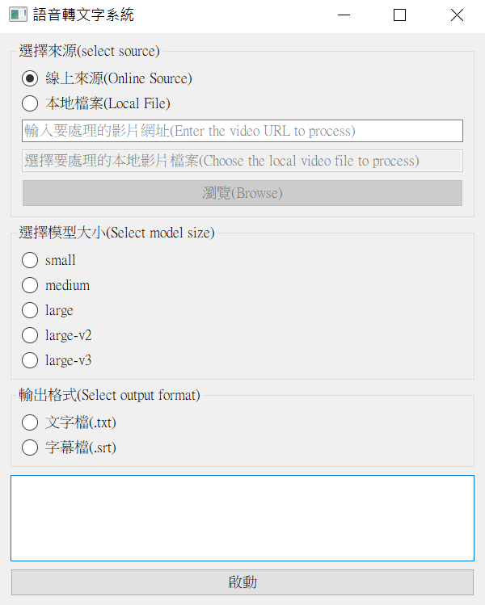

# GenerateVideoSubtitles
Update on 2024.10.31:  
Added documentation.  
Added a simple CLI with usage instructions:  
```
python CLI.py "your_url"
```
Default model:`large-v2`

This project can convert audio from videos into text. The functionalities include:

1. Users can choose between online or local sources; currently, only YouTube is supported for online sources.
2. The model used is faster-whisper, and users can select the model size. For better accuracy, it is recommended to use large-v3. If performance is insufficient, small can be selected.
3. The output can be chosen as either srt or txt format.
4. The language of the video is generally not restricted, but English works best, and Chinese will be output in Traditional Chinese.
5. When processing videos longer than 5 minutes, the video is processed in segments to help the model recognize the audio better.
6. The GUI is available for use.



Environment:  
Driver Version: 566.03  
CUDA Version: 12.7  
CUDA Toolkit 12.6 Update 2  
cuDNN v9.5  

Requirements:   
CUDA Installation: Requires CUDA installation, and at least 3-4 GB of memory is recommended.  
Dependencies: Install the packages listed in requirements.txt. After installation, please additionally run:
```
pip3 install torch torchvision torchaudio --index-url https://download.pytorch.org/whl/cu124
```


Usage Method:
 ```shell
 git clone https://github.com/JoeYang1412/GenerateVideoSubtitles.git
 ```
 Open `GUI.py` to use the application.

Current Issues:
1. It is unclear if the dependencies in the requirements file are complete.
2. The functionality for local sources is actually incomplete.
3. When processing videos longer than 5 minutes, sometimes only the first 5 minutes are processed.
4. When processing certain videos, the program may suddenly stop and only output partial results.(It has been fixed; a language selection option has been added. If this issue occurs again, try resolving it by choosing a different language option.)
5. There may be other issues not mentioned.

2024.10.31 更新：
新增說明  
新增簡易 CLI，使用方法  
```
python CLI.py "your_url"
```
預設使用 `large-v2` 模型

本專案可以將影片中的聲音，轉換成文字  
功能有
1. 可選擇線上或是本地來源，線上目前僅支援Youtube
2. 模型為faster-whisper，可以選擇模型大小，若要精準，建議large-v3，若效能不足，可選擇small
3. 可選擇輸出成srt或是txt
4. 影片語言基本上不限，但英文效果最好，中文則會輸出成繁體中文
5. 處理超過5分鐘以上影片時，會分段處理，讓模型較好辨識
6. 可以使用GUI


環境：
Driver Version: 566.03  
CUDA Version: 12.7  
CUDA Toolkit 12.6 Update 2  
cudnn v9.5  


需求：  
需要安裝cuda  
且記憶體最少需要3-4G會比較好  
另請先安裝 `requirement.txt` 中的套件  
安裝完後請額外安裝  
```
pip3 install torch torchvision torchaudio --index-url https://download.pytorch.org/whl/cu124
```

使用方法：
 ```shell
 git clone https://github.com/JoeYang1412/GenerateVideoSubtitles.git
 ```
打開 GUI.py 即可使用


目前有以下幾個問題
1. dependcy不太確定是不是只有requirements中的那些
2. 來源為本地的功能其實並不完整
3. 處理超過5分鐘影片時，有時候只會處理到前五分鐘
4. 處理特定影片時，程式可能會突然中斷，並且僅輸出部分結果(已修復；新增語言選項，若遇到此問題時，嘗試使用選擇語言來解決此問題)
5. 可能有其他未提及的問題

